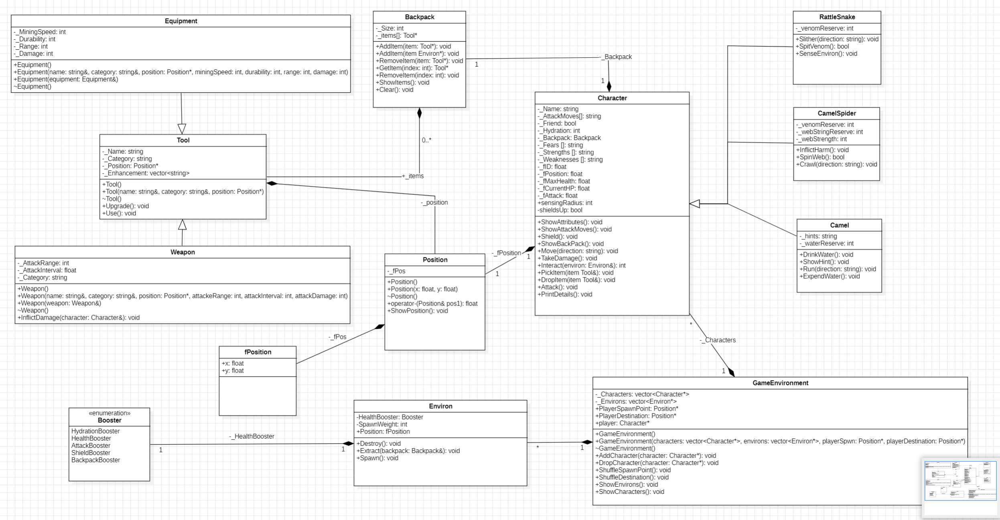

# Project Title

## Table of Contents

- [About](#about)
- [Getting Started](#getting_started)
- [UML Diagram](#uml)

## About 

In the scorching sun of the desert, and the sand-filled wind blowing hot air on the player's face. The player is meant to make it across the savanna. Mapless! However, the Camel has hints for the player, the Camel also has a water reserve in case the player is dehydrated. It is possible for the player to die from dehydration in this harsh desert. The player also needs to stay away from cacti, rattlesnakes, camel spiders (yeah they're a thing) and any enemies on the way. The player only has villagers as friends and the camel. As you travel through this savanna conserve your energy (there's a dehydration rate that automatically gorges upon your hydration value), find the camel, and get the hints to the oasis. Evade enemies if you haven't yet gotten to the oasis to prevent wasting your energy. Get to the oasis and drink up, fight your foes and get across the Savanna. Then you're safe. Good Luck!! Haha!

## Getting Started 

Open the `.sln` file in Visual Studio. I recommend that you use Visual Studio if you'd like to run the code.

### Prerequisites

Install Visual Studio [here](https://visualstudio.microsoft.com/downloads/)

## UML Diagram 

https://github.com/Billy-06/CPPGame/assets/80063605/ed3245b5-ff04-4948-ac2d-5bd4bf07663b

https://github.com/Billy-06/CPPGame/assets/80063605/8eeea009-ecf4-448b-8971-4cd26bcac59e

